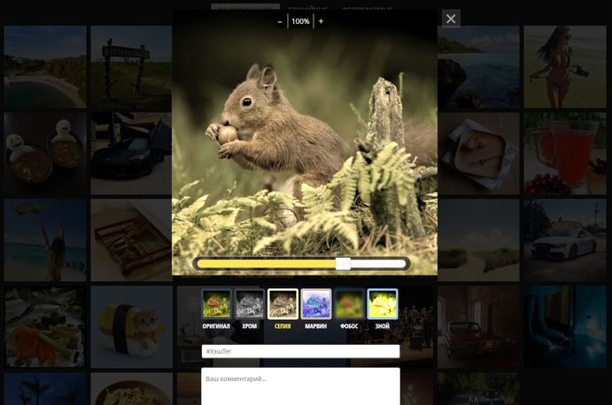

# 📋 Личный проект «Kekstagram»

**Кекстаграм — сервис просмотра изображений. Пользователям предоставлена возможность загружать и редактировать свои фотографии или просматривать фотографии, загруженные другими пользователями. Цель проекта - реализовать функциональность на JavaScript в соответствии с техническим заданием, критериями качества HTML Academy.**

*Учебный проект, выполненный в рамках первого курса JavaScript в HTML Academy.*


## 💡 Обзор выполненных задач
Реализованы следующие функции и возможности:

### ✔ Фильтрация изображений от других пользователей
### ✔ Просмотр загруженных изображений
- отрисовка модального окна.
- загрузка дополнительных комментариев.
### ✔ Работа с сервером
- получение данных с сервера.
- отправка данных на сервер.
- отображение сообщений при ошибке отправки или загрузки, при успешкой отправке.
### ✔ Загрузка нового изображения на сайт
### ✔ Валидация хэштегов и комментариев с использованием библиотеки PristineJS.
### ✔ Редактирование изображений
- редактирование масштаба.
- наложение эффекта на изображение.
- регулировка глубины эффекта с использованием библиотеки noUiSlider.




## 📖 Библиотеки

- [PristineJS](https://pristine.js.org/).
- [noUiSlider](https://refreshless.com/nouislider/).


## 🛠 Технологии и инструменты

- JavaScript (ES6+)
- Взаимодействие с API с использованием **fetch** для загрузки и отправки данных
- Инструменты для обработки данных: массивы и объекты, методы работы с ними (slice, map sort, forEach, деструктуризация и др.).
- Git
- VS Code


## 📌 Ссылка на проект

https://anastasiya-lemeshko.github.io/kekstagram/


## 🚀 Установка и запуск:

**Установка Node.js и NPM**:
   - Установите Node.js (поддерживаемая версия 18+).
   - Для установки зависимостей необходимо выполнить команду
   ```bash
   npm i
   ```

**Запуск проекта**:
   - Запустите сервер с помощью команды
   ```bash
   npm run start
   ```
   - Сервер будет доступен по адресу `http://localhost:3000`.
